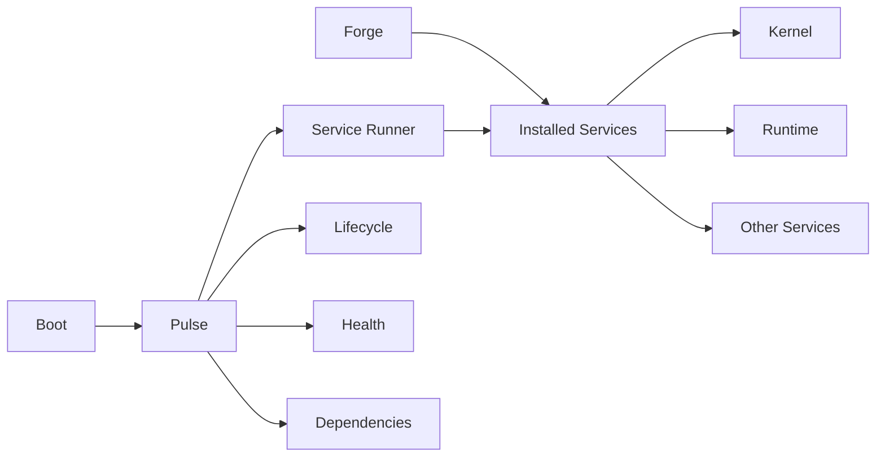

<div align="center">


# ARC V2 Core

### The operating core of ARC V2.

**System foundation · service-oriented · Linux-native**


</div>

---

## Overview

**ARC V2 Core** is the foundational system layer of ARC V2.

It provides the boot process, service architecture, lifecycle management,
supervision, dependency handling, and service management required to operate
ARC as a persistent Linux environment.

Core deliberately separates **installation**, **supervision**, and
**service execution** into independent components.



### The Core Components

| Component          | Responsibility                                                                  |
| ------------------ | ------------------------------------------------------------------------------- |
| **Boot**           | Initializes ARC and starts the core system                                      |
| **Pulse**          | Supervises service lifecycle, readiness, health and dependencies                |
| **Forge**          | Manages installation and state of ARC components and services                   |
| **Service Runner** | Provides the execution environment and service protocol for individual services |
| **Services**       | Independent components that provide ARC capabilities                            |

### The Separation

> **Forge manages what is installed.**
> **Pulse manages what is running.**
> **Service Runner provides how a service runs.**

Forge and Pulse therefore have deliberately different responsibilities.

Forge can install a service without ever starting it. Pulse does not use Forge
to supervise running services. Instead, Pulse communicates with the Service
Runner, which loads and executes the installed service.

---

## Architecture

### Boot

Boot is the entry point for ARC Core.

It initializes the core system and starts Pulse, which then takes responsibility
for service supervision.

### Pulse

Pulse is the **service supervisor**.

It is responsible for:

* determining service startup order
* managing service lifecycle
* handling service dependencies
* checking readiness and health
* restarting services according to their configuration
* stopping services during shutdown

Pulse controls the lifecycle of services without needing to know their internal
implementation.

### Forge

Forge is the **component and package manager for ARC**.

It manages the installed state of ARC services and components, including:

* resolving component sources
* reading ARC service metadata
* managing the ARC service runtime environment
* installing Python packages
* registering installed services
* maintaining lock information
* managing service configuration known to Pulse

Forge answers:

> **What is installed in ARC, from where, and at which version?**

Forge does **not** provide the runtime supervision mechanism for services.

### Service Runner

The **Service Runner** is a separate runtime component used by Pulse to execute
individual ARC services.

It is installed into ARC's dedicated service runtime environment when required.
This environment is separate from the environment from which the `arc` command
is invoked.

The Runner provides the common execution and communication mechanism for an
ARC service. It is responsible for loading the service implementation,
constructing its context, starting it, receiving control commands, and
reporting status and results back to Pulse.

Conceptually:

```text
Core
  │
  │ start service
  ▼
Service Runner
  │
  │ load
  ▼
ARC Service
```

Pulse retains the control connection and remains responsible for supervision.

### Service

A service contains the actual application or system capability.

Core does not need to know how a service internally works. It only needs the
service contract and the mechanisms provided by the Service Runner to control
and supervise it.

---

## Installation

### Development

Clone the repository and synchronize the project with `uv`:

```bash
git clone https://github.com/ARC-V2-AI/ARC-V2-Core.git
cd ARC-V2-Core

uv sync
```

Run ARC:

```bash
uv run arc
```

Or run the boot module directly:

```bash
uv run python -m arc.boot.boot
```

### CLI Installation

Install ARC directly from GitHub:

```bash
uv tool install git+https://github.com/ARC-V2-AI/ARC-V2-Core.git
```

Then run:

```bash
arc
```

Upgrade the installed CLI:

```bash
uv tool upgrade arc
```

---

## CLI

The `arc` command provides both system startup and service management.

### Start ARC

Start ARC normally:

```bash
arc
```

Enable automatic fixes during startup:

```bash
arc --autofix
```

### Install a Service

Install a service from a source:

```bash
arc install <source>
```

Install in editable mode:

```bash
arc install <source> --editable
```

### Remove a Service

```bash
arc remove <service-id>
```

### List Installed Services

```bash
arc list
```

### Inspect a Service

```bash
arc info <service-id>
```

The `info` command displays the service ID, name, version, package, module,
description, restart configuration, health configuration, and dependencies.

---

## Service Runtime

Installed ARC services run inside ARC's dedicated service runtime environment.

The runtime environment contains the packages required by installed services,
including the Service Runner used by Pulse.

The environment used to invoke the `arc` CLI is therefore not necessarily the
environment in which services execute.

The resulting separation is:

```text
User / CLI
    │
    ▼
  Forge
    │
    │ installation
    ▼
ARC Service Runtime
    │
    ├── Service Runner
    └── Installed Services
             ▲
             │
             │ control / status
             │
           Pulse
```

This allows service installation and service execution to remain independent
concerns.

---

## Configuration

ARC Core uses environment-based configuration.

Configuration and environment variables are documented in:

[`docs/CONSTANTS.md`](./docs/CONSTANTS.md)

Do not commit secrets or private configuration files to the repository.

---

## Documentation

ARC Core uses concept documentation to describe its architecture and
implementation conventions.

| Document                                   | Purpose                                 |
| ------------------------------------------ | --------------------------------------- |
| [`docs/CONCEPTS.md`](./docs/CONCEPTS.md)   | Standard for ARC concept documentation  |
| [`docs/SERVICES.md`](./docs/SERVICES.md)   | Service architecture and implementation |
| [`docs/CONSTANTS.md`](./docs/CONSTANTS.md) | Environment variables and configuration |

Additional documentation will be added as the Core architecture develops.

---

## Current Status

> [!WARNING]
> ARC V2 Core is in **active development** and its architecture may continue to evolve.

The current Core focus is the foundational service environment:

* boot and system initialization
* Pulse supervision
* service lifecycle management
* dependency handling
* Forge-based service installation and management
* Service Runner integration

Automated tests are not yet implemented.

---

## Contributing

ARC V2 Core is actively developing its architecture.

For significant architectural changes, discuss the direction before making
large changes. Documentation and focused improvements are welcome.

---

## License

ARC V2 Core is licensed under the
**GNU Affero General Public License v3.0 (AGPL-3.0)**.

See [`LICENSE`](./LICENSE) for the full license text.

---

<div align="center">

**ARC V2 Core**

*The operating core of ARC V2.*

</div>
