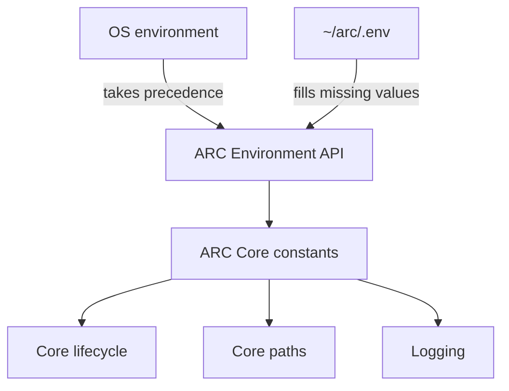

# Environment Variables

> ARC Core uses environment variables as its primary configuration input. The global `~/arc/.env` file provides local configuration and defaults.

## At a glance

|                       |                                                           |
| --------------------- | --------------------------------------------------------- |
| **Role**              | ARC Core runtime configuration                            |
| **Source**            | OS environment + `~/arc/.env`                             |
| **Loaded by**         | ARC Core configuration layer                              |
| **Override behavior** | Existing OS environment variables take precedence         |
| **Provides**          | Core paths, lifecycle behavior, and logging configuration |
| **Status**            | Implemented                                               |

## What it does

ARC Core reads configuration from the operating-system environment and from:

```text
~/arc/.env
```

The `.env` file is loaded before configuration constants are evaluated.

If the file does not exist, ARC continues using its built-in defaults.

> [!IMPORTANT]
> Values already defined in the OS environment are not overwritten by `.env`. ARC uses `override=False`, so the OS environment takes precedence.

Configuration values are exposed through typed helpers for strings, booleans, integers, floats, and paths.

## Reference

These are the environment variables currently defined by **ARC Core**.

### System

| Variable                       | Default | Purpose                                                                                    |
| ------------------------------ | ------: | ------------------------------------------------------------------------------------------ |
| `TERMINAL_NO_COLOR`            |     `0` | Disable terminal colors when enabled.                                                      |
| `STRICT_ERRORS`                |     `1` | Stop or raise on service lifecycle errors instead of continuing with failed services.      |
| `WAIT_ON_DEPENDENCIES`         |     `1` | Wait for required service dependencies to become ready before starting dependent services. |
| `MAX_UNHEALTHY_SERVICE_CHECKS` |     `3` | Number of consecutive unhealthy checks before Pulse applies the configured health policy.  |

### Core directories and files

| Variable              | Default                   | Purpose                                                   |
| --------------------- | ------------------------- | --------------------------------------------------------- |
| `ARC_DIR`             | `~/arc`                   | Root directory of the ARC installation.                   |
| `SERVICE_RUNTIME_DIR` | `~/arc/runtime`           | Python runtime environment used to execute ARC services.  |
| `SERVICE_LOCK`        | `~/arc/arc.lock`          | Lock file containing resolved service installation state. |
| `SERVICE_CONFIG`      | `~/arc/services.arc.yaml` | Service configuration consumed by Pulse.                  |

### Logging

| Variable           |                   Default | Purpose                                |
| ------------------ | ------------------------: | -------------------------------------- |
| `LOG_LEVEL`        |                    `INFO` | Logging verbosity.                     |
| `LOG_FILE`         | `~/arc/arc.log` | ARC Core log file.                     |
| `LOG_CONSOLE`      |                       `1` | Enable console logging.                |
| `LOG_JSON`         |                       `0` | Enable JSON-formatted logs.            |
| `LOG_ROTATE`       |                       `1` | Enable log rotation.                   |
| `LOG_MAX_BYTES`    |                `10485760` | Maximum log-file size before rotation. |
| `LOG_BACKUP_COUNT` |                       `2` | Number of rotated log files to retain. |

## Example

A minimal `~/arc/.env` for ARC Core could look like:

```env
ARC_DIR=~/arc

SERVICE_RUNTIME_DIR=~/arc/runtime
SERVICE_LOCK=~/arc/arc.lock
SERVICE_CONFIG=~/arc/services.arc.yaml

STRICT_ERRORS=1
WAIT_ON_DEPENDENCIES=1
MAX_UNHEALTHY_SERVICE_CHECKS=3

LOG_LEVEL=INFO
LOG_FILE=~/arc/arc.log
LOG_CONSOLE=1
LOG_JSON=0
LOG_ROTATE=1
LOG_MAX_BYTES=10485760
LOG_BACKUP_COUNT=2
```

Values do not need to be present in `.env` when the built-in default is sufficient.

## How it works



ARC loads the `.env` file before evaluating the remaining configuration constants:

```python
ENV_LOADED = load_dot_env()
```

The loader uses:

```python
load_dotenv(
    ENV_PATH,
    override=False,
)
```

Therefore:

```text
OS environment
      ↓
   precedence
      ↓
~/arc/.env
      ↓
ARC Core defaults
```

More precisely, `.env` fills values that are not already provided by the OS environment, while the Python constants provide the final fallback defaults.

## Path handling

ARC Core uses `~/arc` as its default installation root.

Paths beginning with `~/` are expanded using the `HOME` environment variable:

```python
ARC_DIR = path(
    get_env("ARC_DIR", "~/arc")
)
```

This allows the same configuration model to work without hard-coding a user's home directory.

## Configuration API

ARC Core provides helpers for reading typed environment values:

```python
get_env(...)
get_env_str(...)
get_env_bool(...)
get_env_int(...)
get_env_float(...)
```

The configuration layer also provides:

```python
set_env(...)
```

which can update values stored in `~/arc/.env`.

## Responsibilities

ARC Core environment variables are responsible for:

* configuring Core startup behavior
* defining Core-owned filesystem locations
* configuring Pulse lifecycle behavior
* configuring Core logging
* providing deployment-specific Core settings

Service-specific configuration should remain with the individual service rather than being added to Core constants.

## Not responsible for

ARC Core environment variables are not the configuration mechanism for:

* inference engine settings
* model paths or model parameters
* service-specific ports
* agent behavior
* service-specific workspace paths
* service-specific integrations
* service implementation state

Those values belong to the corresponding service or component.

## Why it exists

Environment-based configuration allows ARC Core to use the same code across different installations while keeping installation paths, lifecycle behavior, and logging settings outside the source code.

The global `.env` also gives the ARC installation a single shared environment that service processes inherit when they are started by Pulse.

## Related concepts

* [Services](./SERVICES.md) — defines the ARC service model and service-level configuration.
* [Forge](./FORGE.md) — installs services and manages `arc.lock` and service registration.
* [Pulse](./PULSE.md) — uses Core lifecycle configuration to supervise services.
* [Service Runner](./SERVICE-RUNNER.md) — executes services inside the ARC service runtime.
