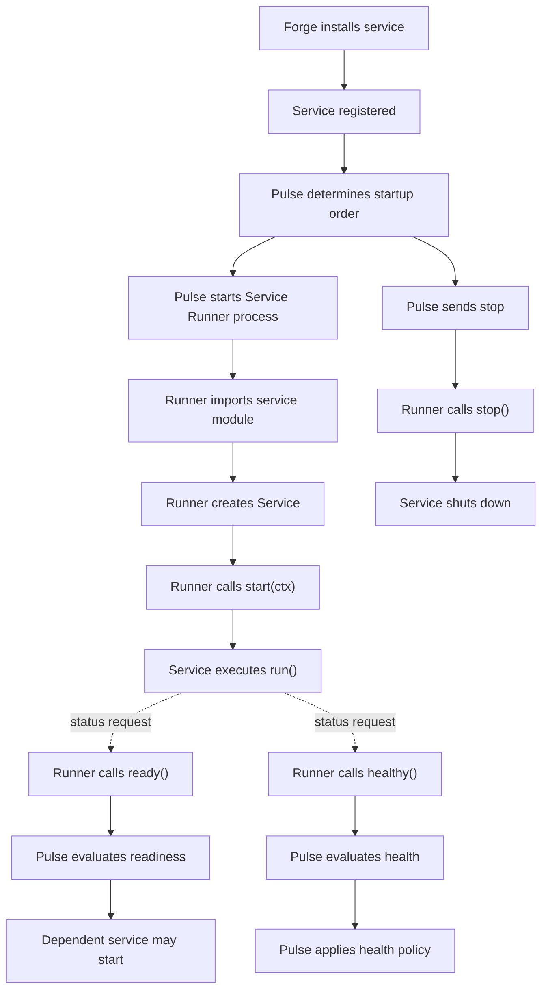

# ARC Services

> An ARC Service is an independently installable, long-running capability executed through the ARC Service Runner and supervised by ARC Pulse.

## At a glance

|                   |                                                                               |
| ----------------- | ----------------------------------------------------------------------------- |
| **Role**          | Independent, long-running capability                                          |
| **Installed by**  | Forge                                                                         |
| **Executed by**   | Service Runner                                                                |
| **Supervised by** | Pulse                                                                         |
| **Depends on**    | Other ARC services, declared via `depends`                                    |
| **Provides**      | A defined service contract, readiness and health reporting, graceful shutdown |
| **Process model** | One independently supervised operating system process per service             |
| **Status**        | Implemented                                                                   |

## Architecture

ARC separates service installation, execution, and supervision into distinct components:

```text
                         ARC Core
                            │
              ┌─────────────┴─────────────┐
              │                           │
            Forge                       Pulse
              │                           │
       installs/registers           supervises lifecycle
              │                           │
              └─────────────┐             │
                            ▼             │
                    ARC Service Runtime  │
                            │             │
                     Service Runner ◄─────┘
                            │
                            ▼
                       ARC Service
```

### Forge

Forge is responsible for installing and managing ARC components.

For a service, Forge resolves its source, reads its ARC service metadata, installs the package into the ARC service runtime, registers the service, and maintains the resolved installation state.

Forge answers:

> **What is installed in ARC?**

Forge does not supervise service processes.

### Pulse

Pulse is the ARC service supervisor.

Pulse reads the registered service configuration, determines dependency order, starts services, waits for required readiness, monitors health, and applies restart or stop policies.

Pulse answers:

> **What should be running, in what order, and is it still healthy?**

Pulse does not contain the implementation of individual services.

### Service Runner

The Service Runner is the common execution layer for ARC services.

It is installed into the ARC service runtime and provides the common `Service` contract, execution context, status/result types, and runner process.

When Pulse starts a service, it launches the runtime Python interpreter with the Service Runner:

```text
runtime/bin/python -m arc_service.runner
```

The Runner then imports the configured service module, discovers the `Service` subclass, creates the service, injects its context, and executes it.

The Runner communicates with Pulse through the service process control and result channels.

The Runner answers:

> **How does an individual ARC service execute and communicate with its supervisor?**

## Service package

A service is distributed as a normal Python package with ARC-specific service metadata.

Example:

```toml
[project]
name = "arc-v2-test-service"
version = "0.1.0"
description = "Test service for ARC V2"
requires-python = ">=3.11"
dependencies = [
    "arc-v2-service-runner>=0.1.0,<0.2.0",
]

[tool.arc.service]
id = "test"
module = "arc_test_service.service"
name = "ARC Test Service"
description = "Minimal service used to test ARC Pulse"
restart = "on-failure"
health = "restart"
depends = []
```

The Python dependency:

```toml
arc-v2-service-runner
```

is a package dependency.

The ARC service dependency:

```toml
depends = []
```

is a service-level dependency used by Pulse.

These are separate concepts.

## Service configuration

After installation, Forge registers the service information used by Pulse in `services.arc.yaml`.

Example:

```yaml
services:
  test:
    module: arc_test_service.service
    restart: on-failure
    health: restart
    depends: []
```

| Key       | Meaning                                           |
| --------- | ------------------------------------------------- |
| `module`  | Python module containing the `Service` subclass   |
| `restart` | Process restart policy                            |
| `health`  | Action to take when health checks repeatedly fail |
| `depends` | ARC services that must become ready first         |

The module is loaded by the Service Runner, not directly by Pulse.

## Restart policies

| Value        | Description                                    |
| ------------ | ---------------------------------------------- |
| `always`     | Restart whenever the service exits.            |
| `on-failure` | Restart when the service exits unsuccessfully. |
| `never`      | Do not restart automatically.                  |

## Health policies

| Value     | Description                                                                      |
| --------- | -------------------------------------------------------------------------------- |
| `ignore`  | Record the unhealthy state but leave the service running.                        |
| `restart` | Restart the service after the configured number of consecutive unhealthy checks. |
| `stop`    | Stop the service after the configured number of consecutive unhealthy checks.    |

## Service contract

Every ARC service inherits from the `Service` class provided by `arc-v2-service-runner`.

```python
from arc_service.service import Service
```

A service implements:

| Method      | Purpose                                            |
| ----------- | -------------------------------------------------- |
| `run()`     | Main service execution                             |
| `ready()`   | Reports whether initialization has completed       |
| `healthy()` | Reports whether the service is operating correctly |
| `stop()`    | Performs graceful shutdown                         |

The Runner calls the service's framework-provided `start(ctx)` method. Service implementations normally do not override `start()`.

A minimal service therefore looks like:

```python
from arc_service.service import Service


class MyService(Service):
    async def run(self) -> None:
        ...

    async def ready(self) -> tuple[bool, str | None]:
        return True, None

    async def healthy(self) -> tuple[bool, str | None]:
        return True, None

    async def stop(self) -> None:
        ...
```

## `BaseContext`

The Service Runner creates a `BaseContext` for each service.

```python
@dataclass(slots=True)
class BaseContext:
    logger: Logger
    env: Mapping[str, str]
    service_name: str
    process_name: str
```

| Field              | Purpose                                      |
| ------------------ | -------------------------------------------- |
| `ctx.logger`       | Logger associated with the service           |
| `ctx.env`          | Environment inherited by the service process |
| `ctx.service_name` | Registered service name                      |
| `ctx.process_name` | Process name used for diagnostics            |

Services receive the context before `run()` starts.

Services do not load the global ARC `.env` file themselves. The ARC environment is prepared before the service process starts and is exposed through the context.

## Lifecycle

The lifecycle is divided between Pulse, Service Runner, and the Service implementation.



### Installation

Forge installs the service package into the ARC service runtime and registers the service.

### Startup

Pulse determines the dependency order and starts the required service process.

The process runs the ARC runtime Python interpreter:

```text
~/arc/runtime/bin/python
```

and launches:

```text
-m arc_service.runner
```

The Runner loads the configured module and discovers its `Service` subclass.

### Execution

The Runner creates the service and its `BaseContext`, then starts the service.

The service performs its main work in `run()`.

### Readiness

Pulse periodically requests status from the Runner.

The Runner asks the service:

```python
await service.ready()
```

Readiness indicates whether initialization has completed.

Typical readiness conditions include:

* model loading completed
* HTTP server is listening
* database connection established
* worker pool initialized
* required internal resources available

A readiness implementation might be:

```python
async def ready(self) -> tuple[bool, str | None]:
    if self._ready:
        return True, None

    return False, "still starting"
```

Pulse waits for required dependencies to become ready before starting dependent services.

### Health

Pulse also requests the service's current health:

```python
await service.healthy()
```

Health represents the service's operational state after startup.

Typical health failures include:

* lost database connection
* failed worker
* unavailable required resource
* unrecoverable internal state

Example:

```python
async def healthy(self) -> tuple[bool, str | None]:
    if self._stopping:
        return False, "service is stopping"

    return True, None
```

### Shutdown

When a service should stop, Pulse sends a stop command to the Runner.

The Runner calls:

```python
await service.stop()
```

The service should release its resources and terminate gracefully.

## Process and communication model

Each service runs in its own operating system process.

Pulse does not import and directly execute the service implementation. Instead, it starts the Service Runner in the ARC service runtime.

```text
Pulse
  │
  │ start process
  ▼
runtime/bin/python
  │
  └── arc_service.runner
          │
          ├── imports service module
          ├── creates Service
          ├── creates BaseContext
          └── runs service
```

Pulse and the Runner communicate through the service process IPC channels.

Conceptually:

```text
Pulse ───── status ─────► Runner
Pulse ◄──── status ────── Runner

Pulse ───── stop ───────► Runner
Pulse ◄──── result ─────── Runner
```

This keeps service implementation details outside Pulse while giving Pulse a consistent interface for every service.

## Responsibilities

### A service is responsible for

* implementing its application logic in `run()`
* reporting initialization state through `ready()`
* reporting operational state through `healthy()`
* shutting down gracefully in `stop()`
* using the provided execution context
* managing its own internal resources

### A service is not responsible for

* determining global startup order
* starting or supervising other ARC services
* restarting itself
* managing service processes
* loading the global ARC `.env` file
* implementing the ARC IPC protocol

Those responsibilities belong to the ARC infrastructure.

## Dependencies

Service dependencies are declared with `depends`.

```toml
[tool.arc.service]
id = "agent"
module = "arc_agent.service"
depends = ["inference", "memory"]
```

Pulse uses these dependencies to construct the startup order.

For example:

```text
inference ──┐
            ├──► agent
memory ─────┘
```

`inference` and `memory` can start independently. The `agent` service is started only after its required dependencies are ready.

## Example

A minimal service:

```python
from __future__ import annotations

import asyncio

from arc_service.service import Service


class TestService(Service):
    def __init__(self) -> None:
        super().__init__(
            name="test",
            version="0.1.0",
            description="Minimal ARC test service",
        )

        self._stop_event = asyncio.Event()
        self._ready = False
        self._ticks = 0

    async def run(self) -> None:
        assert self.ctx is not None

        self.ctx.logger.info("Test service starting")

        await asyncio.sleep(2)

        self._ready = True
        self.ctx.logger.info("Test service ready")

        try:
            while not self._stop_event.is_set():
                self._ticks += 1

                self.ctx.logger.info(
                    "Tick %d",
                    self._ticks,
                )

                await asyncio.sleep(5)

        except asyncio.CancelledError:
            raise

        finally:
            self.ctx.logger.info("Test service stopped")

    async def ready(self) -> tuple[bool, str | None]:
        if self._ready:
            return True, None

        return False, "still starting"

    async def healthy(self) -> tuple[bool, str | None]:
        if self._stop_event.is_set():
            return False, "service is stopping"

        return True, None

    async def stop(self) -> None:
        assert self.ctx is not None

        self.ctx.logger.info("Stopping test service")
        self._stop_event.set()
```

## Best practices

* Inherit from `arc_service.service.Service`.
* Keep `run()` focused on the service's actual long-running work.
* Use `ready()` only for initialization state.
* Use `healthy()` only for operational health.
* Keep `ready()` and `healthy()` lightweight because Pulse may call them frequently.
* Use `ctx.logger` for service logging.
* Release resources in `stop()`.
* Avoid blocking the event loop.
* Keep services independently restartable.
* Keep service dependencies explicit through `depends`.

## Related concepts

* [Pulse](./PULSE.md) — supervises service processes, dependencies, readiness, health, and failure recovery.
* [Forge](./FORGE.md) — installs and manages ARC components and service registration.
* [Service Runner](./SERVICE-RUNNER.md) — provides the service contract and execution runtime.
* [Environment Variables](./CONSTANTS.md) — defines the ARC environment available to services.
