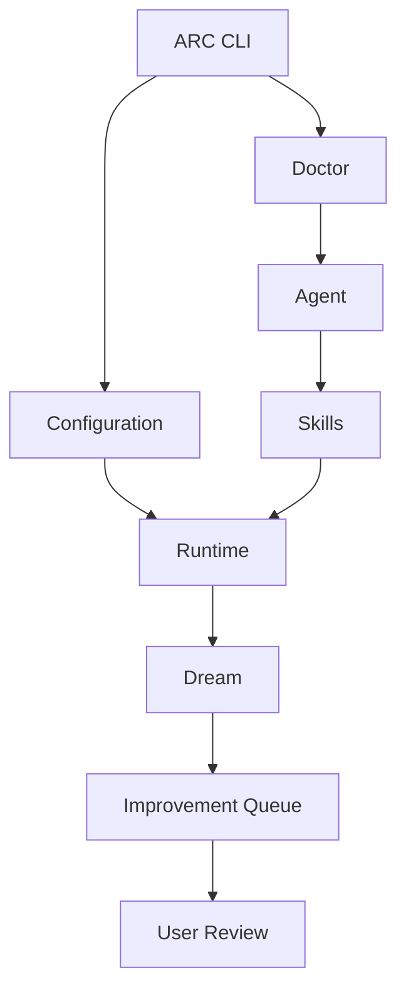
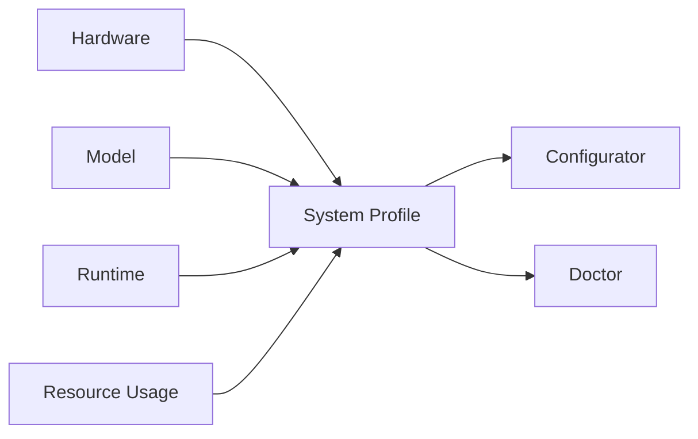
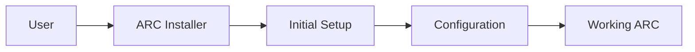
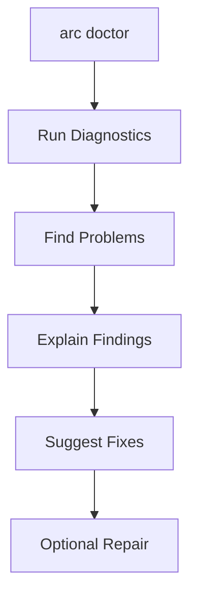
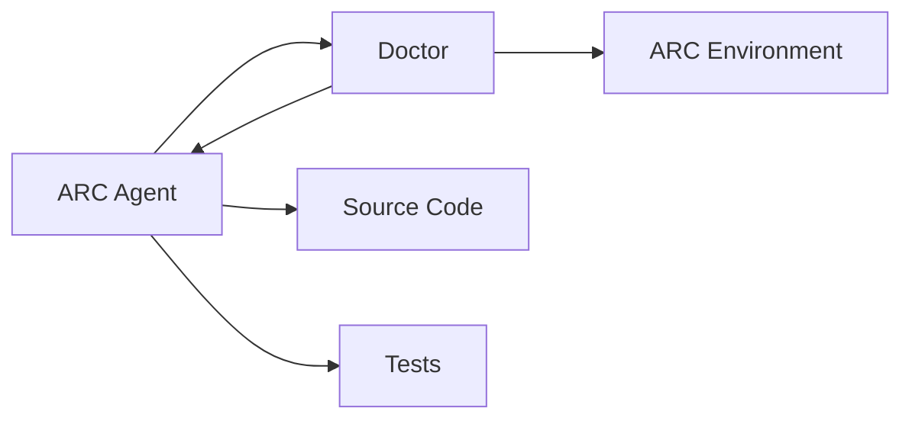
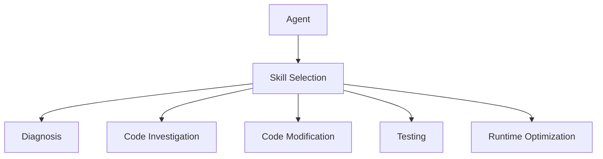
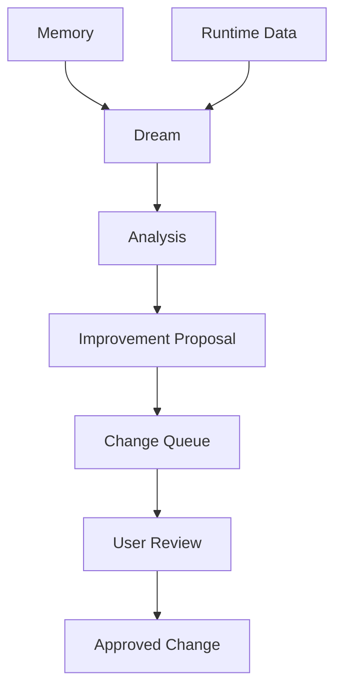
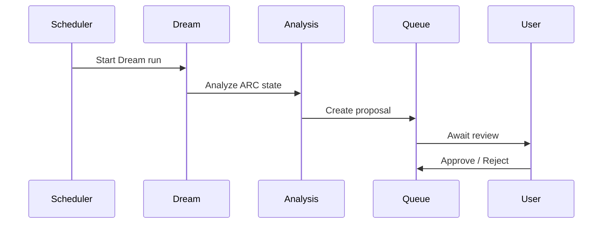
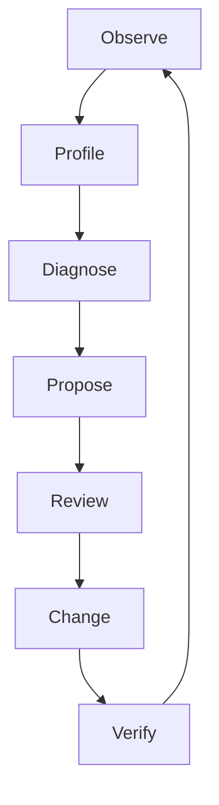

# ARC — Ideas & Scratchpad

> [!NOTE]
> A scratchpad for ideas, architectural directions, experiments, and things ARC might eventually do.
>
> Nothing here should be treated as committed architecture or a delivery plan.

---

## The general idea

ARC should gradually become better at **understanding its own environment, diagnosing problems, tuning itself, and helping improve its own implementation**.

The rough direction:



---

# Ideas

## Automatic environment configuration

ARC could inspect the machine it is running on and automatically build a sensible configuration.

Things worth detecting:

* CPU / GPU / VRAM
* RAM
* Available model
* Current runtime configuration
* Runtime performance
* Resource usage

Potential tuning targets:

* Context size
* Batch size
* GPU layers
* Flash Attention
* KV cache
* Other runtime-specific settings

The important part is that this should be **adaptive, not reckless**.

> [!WARNING]
> “Maximum performance” should never simply mean “push every setting as high as possible.”

Changes should stay within detected hardware limits and should be inspectable and reversible.

---

## Passive profiler

A lightweight profiler could continuously collect useful runtime information rather than relying on isolated benchmarks.



Possible data:

* Hardware characteristics
* Model characteristics
* Generation speed
* Memory usage
* Context usage
* Runtime errors
* Resource pressure
* General system behaviour

> [!NOTE]
> Metrics, storage format, and profiling frequency are intentionally undefined.

---

# Installation

ARC should eventually feel like a complete system rather than a collection of manually assembled components.

Possible direction:



The installer could eventually handle:

* Dependencies
* Initial directories
* Configuration
* Runtime setup
* Model setup
* Service setup

> [!NOTE]
> Keep this deliberately simple until the architecture stabilizes.

---

# CLI configuration

Potential commands:

```bash
arc configure
arc settings
```

The goal is simply to avoid forcing users to edit `.env` by hand for normal configuration.

Possible areas:

* Runtime
* Models
* Performance
* Services
* Agent behaviour

Whether this becomes one command or multiple commands is still open.

---

# `arc doctor`

A central diagnostic system for ARC.



Normal mode:

```bash
arc doctor
```

Potential repair mode:

```bash
arc doctor --fix
```

Doctor could inspect:

* Configuration
* Services
* Runtime
* Models
* Dependencies
* Hardware compatibility
* Logs
* Common failure states

> [!WARNING]
> `--fix` should never mean unrestricted system modification.

A guardrail layer should decide what is:

* Safe to change automatically
* Allowed only after confirmation
* Suggestion-only
* Never automatically modifiable

---

# Agent + Doctor

The agent could eventually use Doctor as part of its normal reasoning loop.



Possible capabilities:

* Investigate failures
* Inspect configuration
* Inspect runtime behaviour
* Trace problems into source code
* Propose fixes
* Modify code
* Run tests
* Verify results

> [!WARNING]
> Code modification should use the same permission model as Doctor repairs.

---

# Skills

ARC could use a dedicated **skill system** instead of stuffing every capability into massive instruction files.

Idea:



The main benefit:

**load specialized capability when needed instead of permanently consuming context.**

Potential skills:

* Diagnosis
* Code investigation
* Code modification
* Testing
* Runtime analysis
* Performance optimization

> [!NOTE]
> The actual skill format/API is still an open design problem.

---

# Dream

A longer-running analysis system for ARC.

The basic idea:

**normal agent execution happens now; Dream thinks about ARC over time.**



Dream might periodically look for:

* Repeated failures
* Inefficiencies
* Configuration problems
* Behaviour patterns
* Missing capabilities
* Potential code improvements

The initial goal should be **proposal generation**, not silent self-modification.

> [!WARNING]
> Dream should not automatically rewrite ARC simply because it found something it dislikes.

---

## Scheduled Dream

Potential future usage:

```bash
arc dream
```

or a scheduled/background invocation through something like cron.

Possible flow:



The scheduling mechanism is not important yet.

---

# Self-improvement loop

The bigger idea tying everything together:



The principle is simple:

> **Observe → understand → propose → verify.**

Not:

> **observe → randomly modify everything.**

---

# Design principles

> [!IMPORTANT]
> **Automatic does not mean unrestricted.**

> [!IMPORTANT]
> **Observe before changing.**

> [!IMPORTANT]
> **Verify changes whenever possible.**

> [!IMPORTANT]
> **Keep the user in control of consequential changes.**

> [!IMPORTANT]
> **Do not waste context on capabilities that are not currently needed.**

---

# Things still floating around

These are intentionally unresolved:

* Profiler metrics
* Profiling frequency
* Performance tuning algorithm
* Safe context limits
* Configurator guardrails
* `arc configure` vs `arc settings`
* Doctor scope
* Doctor repair permissions
* Agent code-modification permissions
* Skill architecture
* Dream storage
* Dream scheduling
* Proposal format
* Review/approval policy

This file is intentionally allowed to change as the ideas become clearer.

> [!NOTE]
> This is a scratchpad, not a contract.
